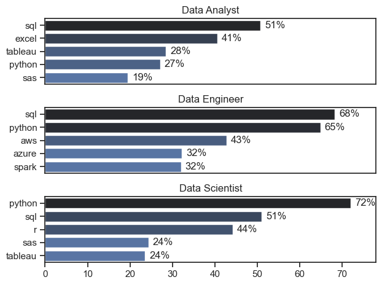
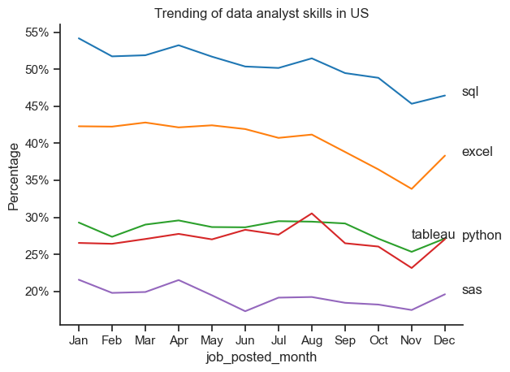
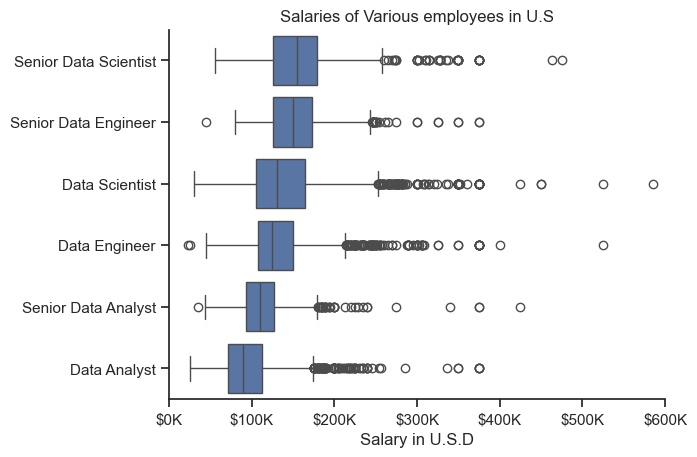
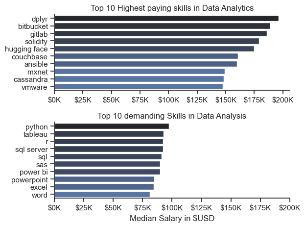
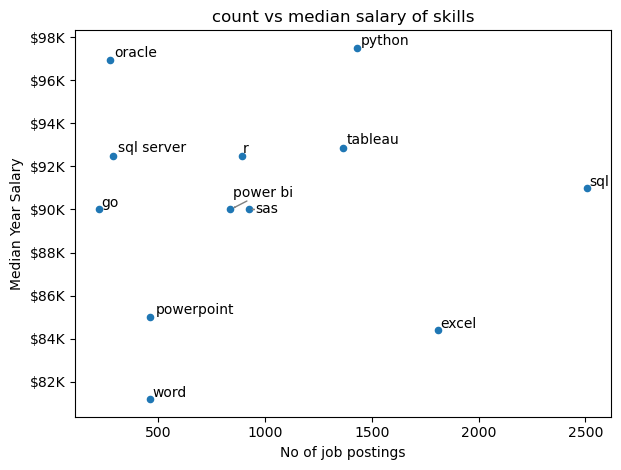
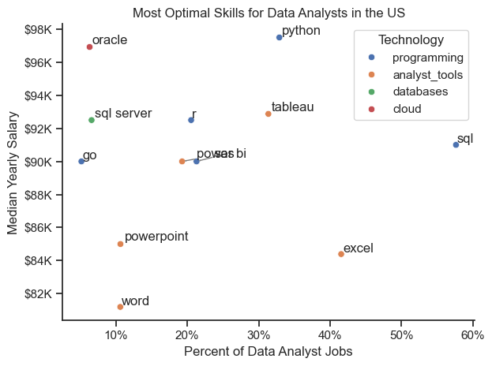

# Dataset : 

# The Analysis
## 1.What are the most demanded skills for the top 3 most popular data roles ?
 To find the most demanded skills for the top 3 most popular data roles. I filtered out those positions by which ones were the most popular, and got the top 5 skills for these top 3 roles. This query highlights the most popular job titles and their top skills, showing which skills I should pay attention to depending on the role I'm targeting.

View my notebook with detailed steps here:
[skill_demand.ipynb](file_skill_demand.ipynb)

## Visualize Data
```python
fig ,ax =plt.subplots(len(job_titles),1)
sns.set_theme(style ='ticks')
for i,n in enumerate(job_titles):
    df_ff = df_f[df_f['job_title_short']==n].head(5)
    sns.barplot(data = df_ff,x='percentage',y='job_skills',hue='count',palette='dark:b_r',ax=ax[i],)
    ax[i].set_title(n)
    ax[i].set_ylabel('')
    ax[i].set_xlabel('')
    ax[i].set_xlim(0,78)
    ax[i].legend().set_visible(False)
    for n,v in enumerate(df_ff['percentage']):
        ax[i].text(v+1,n, f'{v:.0f}%',va='center')
    
    if i!=len(job_titles)-1:
     ax[i].set_xticks([])

fig.tight_layout()
```
### Results
   

   ### Insights
  - SQL is the most requested skill for Data Analysts and Data Scientists, with it in over half the job postings for both roles. For Data Engineers, Python is the most sought-after skill, appearing in 68% of job postings.
- Data Engineers require more specialized technical skills (AWS, Azure, Spark) compared to Data Analysts and Data Scientists who are expected to be proficient in more general data management and analysis tools (Excel, Tableau).
- Python is a versatile skill, highly demanded across all three roles, but most prominently for Data Scientists (72%) and Data Engineers (65%).

## 2.How are in-demand skills trending for Data Analysts?

To find how skills are trending in 2023 for Data Analysts, I filtered data analyst positions and grouped the skills by the month of the job postings. This got me the top 5 skills of data analysts by month, showing how popular skills were throughout 2023.

View my notebook with detailed steps here: [Skills_Trend](file_skills_trend.ipynb)

## Visualize Data
``` python
from matplotlib.ticker import PercentFormatter
ax=plt.gca()
ax.yaxis.set_major_formatter(PercentFormatter(decimals=0))
for i in range(5):
    if i==2:
        plt.text(10,df_f.iloc[-1,i],df_f.columns[i])
    else:
        plt.text(11.5,df_f.iloc[-1,i],df_f.columns[i])
 ```
 ## Results 



   ## Insights: 
   - SQL remains the most consistently demanded skill throughout the year, although it shows a gradual decrease in demand.
- Excel experienced a significant increase in demand starting around September, surpassing both Python and Tableau by the end of the year.
- Both Python and Tableau show relatively stable demand throughout the year with some fluctuations but remain essential skills for data analysts. Power BI, while less demanded compared to the others, shows a slight upward trend towards the year's end.

##  3.How well do jobs and skills pay for Data Analysts?

To identify the highest-paying roles and skills, I only got jobs in the United States and looked at their median salary. But first I looked at the salary distributions of common data jobs like Data Scientist, Data Engineer, and Data Analyst, to get an idea of which jobs are paid the most.

View my notebook with detailed steps here: [skill_pay_analysis](skill_analysis.ipynb)

### Visualise Data
``` python
sns.boxplot(data = df_us ,x='salary_year_avg',y='job_title_short',order=cor)
sns.set_theme(style='ticks')
sns.despine()
plt.title('Salaries of Various employees in U.S')
plt.xlim(0,600000)
plt.ylabel('')
plt.xlabel('Salary in U.S.D')
ticks_x=plt.FuncFormatter(lambda y,pos: f'${int(y/1000)}K')
plt.gca().xaxis.set_major_formatter(ticks_x)
```
### Results :
  

  ### Insights: 
- There's a significant variation in salary ranges across different job titles. Senior Data Scientist positions tend to have the highest salary potential, with up to $600K, indicating the high value placed on advanced data skills and experience in the industry.

- Senior Data Engineer and Senior Data Scientist roles show a considerable number of outliers on the higher end of the salary spectrum, suggesting that exceptional skills or circumstances can lead to high pay in these roles. In contrast, Data Analyst roles demonstrate more consistency in salary, with fewer outliers.

- The median salaries increase with the seniority and specialization of the roles. Senior roles (Senior Data Scientist, Senior Data Engineer) not only have higher median salaries but also larger differences in typical salaries, reflecting greater variance in compensation as responsibilities increase.
## 4.Highest Paid & Most Demanded Skills for Data Analysts
Next, I narrowed my analysis and focused only on data analyst roles. I looked at the highest-paid skills and the most in-demand skills. I used two bar charts to showcase these.

### Visualize Data 
``` python
fig,ax = plt.subplots(2,1)
sns.set_theme(style='ticks')
sns.despine()
sns.barplot(data= jb_median,x= 'median',y='job_skills',ax=ax[0],hue='median',palette='dark:b_r')
ax[0].set_title('Top 10 Highest paying skills in Data Analytics')
ax[0].set_ylabel('')
ax[0].set_xlabel('')
ax[0].legend().set_visible(False)
ax[0].xaxis.set_major_formatter(plt.FuncFormatter(lambda x, _: f'${int(x/1000)}K'))


sns.barplot(data = jb_count,y='job_skills',x='median',ax=ax[1],hue='median',palette='dark:b_r')
ax[1].set_title('Top 10 demanding Skills in Data Analysis')
ax[1].set_ylabel('')
ax[1].set_xlabel('Median Salary in $USD')
ax[1].legend().set_visible(False)
ax[1].xaxis.set_major_formatter(plt.FuncFormatter(lambda x, _: f'${int(x/1000)}K'))
ax[1].set_xlim(0,200000)
fig.tight_layout()
``` 
### Results


## 5.What are the most optimal skills to learn for Data Analysts?

To identify the most optimal skills to learn ( the ones that are the highest paid and highest in demand) I calculated the percent of skill demand and the median salary of these skills. To easily identify which are the most optimal skills to learn.

View my notebook with detailed steps here: [optimal_skills](optimal_skills.ipynb)

### Visualize Data

``` python
    df_f.plot(kind= 'scatter',x='count',y='median')
text=[]
for i,n in enumerate(df_f.index):
       text.append(plt.text(df_f['count'].iloc[i],df_f['median'].iloc[i],n))

adjust_text(text,arrowprops=dict(arrowstyle='->',color='gray'))
plt.title('count vs median salary of skills')
plt.xlabel('No of job postings')
plt.ylabel('Median Year Salary')
plt.tight_layout()
```
### Results: 



### Insights:

- The skill Oracle appears to have the highest median salary of nearly $97K, despite being less common in job postings. This suggests a high value placed on specialized database skills within the data analyst profession.

- More commonly required skills like Excel and SQL have a large presence in job listings but lower median salaries compared to specialized skills like Python and Tableau, which not only have higher salaries but are also moderately prevalent in job listings.

- Skills such as Python, Tableau, and SQL Server are towards the higher end of the salary spectrum while also being fairly common in job listings, indicating that proficiency in these tools can lead to good opportunities in data analytics.

### Visualize Data


``` python 

from matplotlib.ticker import PercentFormatter


scatter = sns.scatterplot(
    data=df_DA_skills_tech_high_demand,
    x='skill_percent',
    y='median_salary',
    hue='technology',  
    palette='bright', 
    distinct colors
    legend='full'  
)
plt.show()

```

### Results :


### Insights : 
- The scatter plot shows that most of the programming skills (colored blue) tend to cluster at higher salary levels compared to other categories, indicating that programming expertise might offer greater salary benefits within the data analytics field.

- The database skills (colored orange), such as Oracle and SQL Server, are associated with some of the highest salaries among data analyst tools. This indicates a significant demand and valuation for data management and manipulation expertise in the industry.

- Analyst tools (colored green), including Tableau and Power BI, are prevalent in job postings and offer competitive salaries, showing that visualization and data analysis software are crucial for current data roles. This category not only has good salaries but is also versatile across different types of data tasks.

